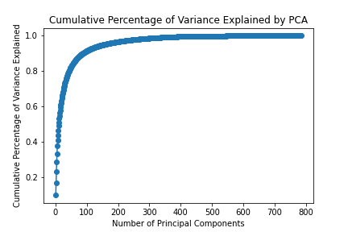
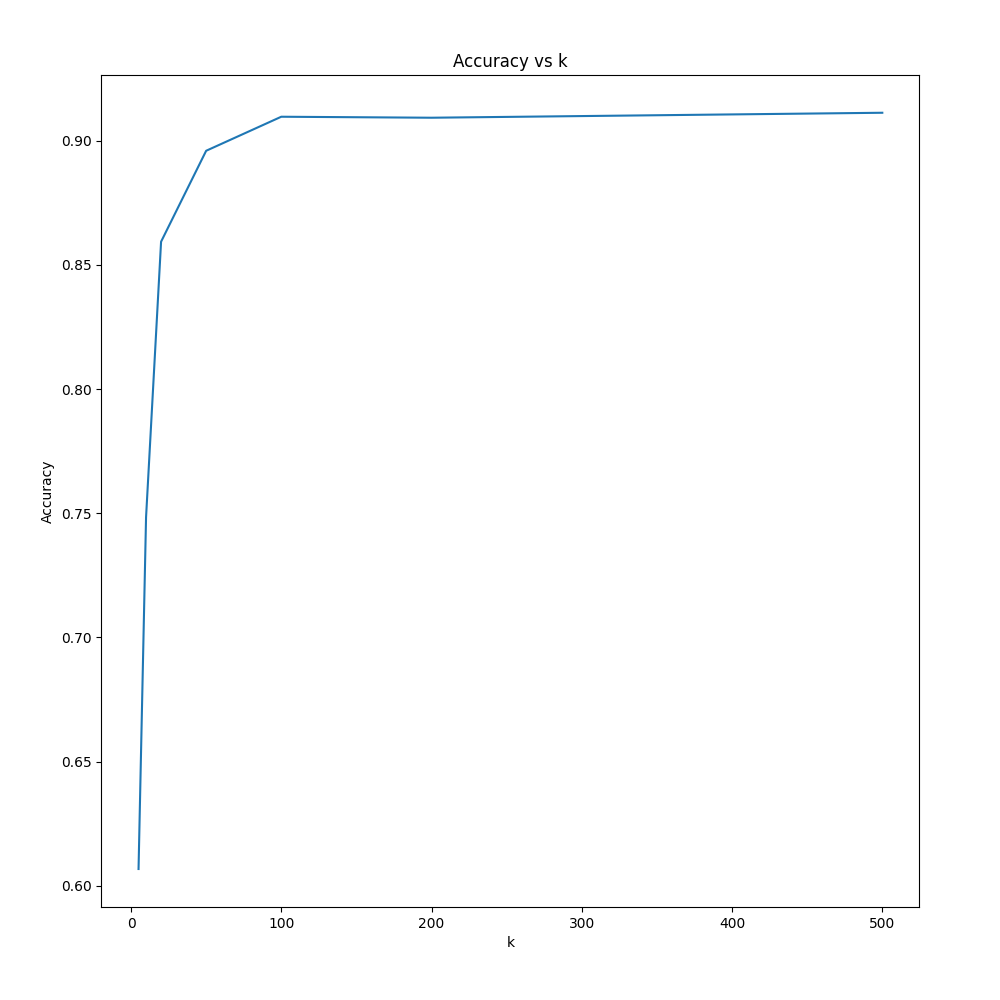
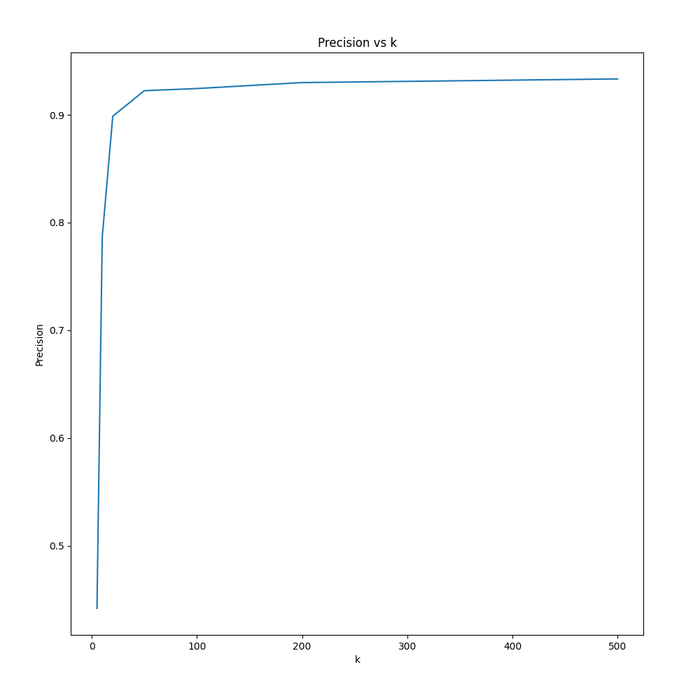
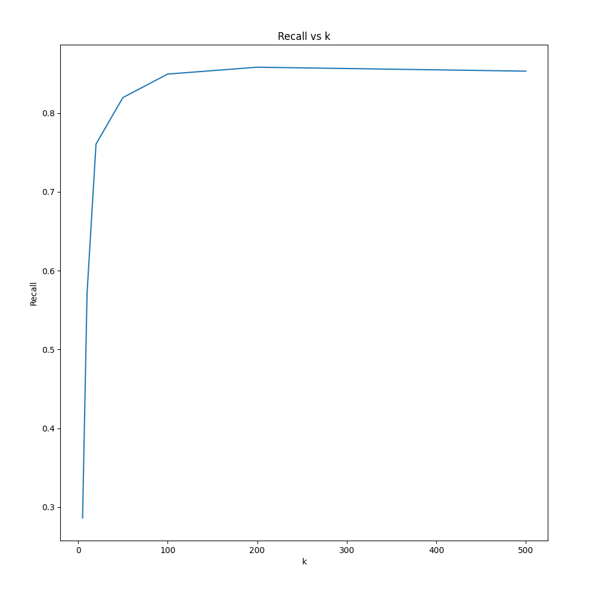
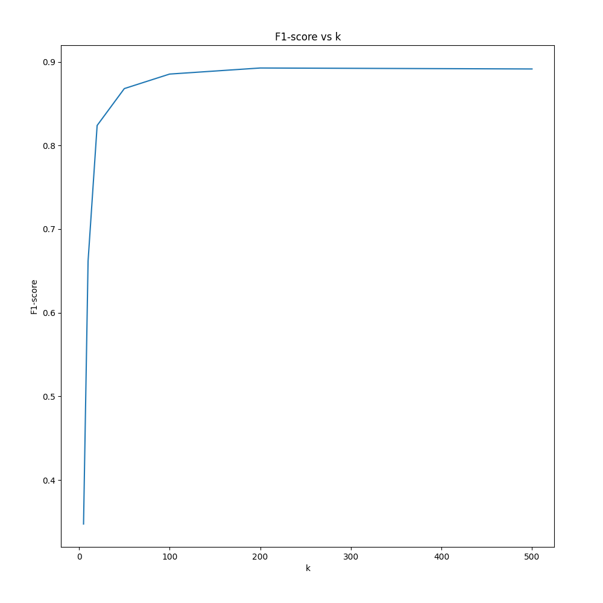
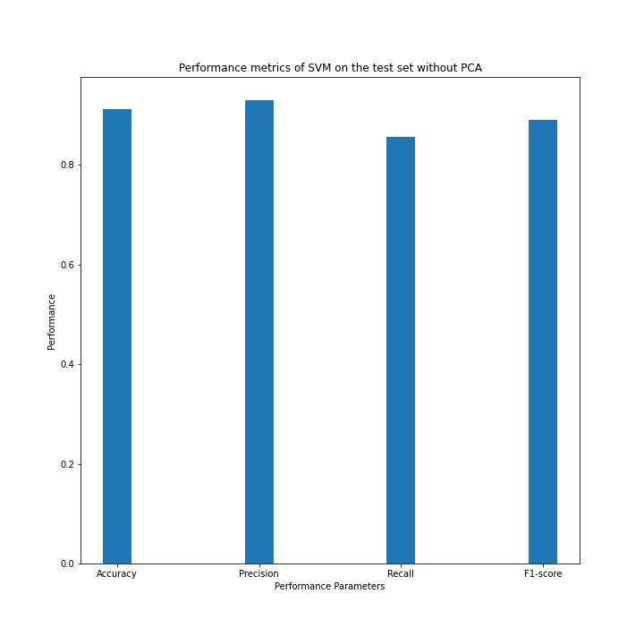

# Support-Vector-Machines
Principal Component Analysis and Support Vector Machines Implementation on MNIST Dataset

# Introduction

Principal Component Analysis (PCA) and Support Vector Machine (SVM) are
widely used techniques in machine learning for dimensionality reduction
and classification, respectively. In this report presented the
methodology, results for SVM and PCA, and analysis of implementing PCA
and SVM algorithms on the MNIST dataset.

# Methodology

## PCA

PCA is a technique for representing the data in reduced dimensionality
while preserving most of its variance. Given a dataset *X* of *n* data
points each with *m* features, PCA finds a new set of *k* orthogonal
basis vectors, called principal components, that best represent the
data. The principal components are found by computing the eigenvectors
of the covariance matrix of the centered data, where the centering
involves subtracting the mean of each feature across all data points.
The first principal component corresponds to the eigenvector with the
largest eigenvalue, and each subsequent principal component corresponds
to the next largest eigenvalue.

  
To implement PCA, first, compute the mean of the data and subtract it
from each data point. Then, computed the covariance matrix of the
centered data using numpy.cov() function in python which uses the given
formula to compute covariance where the input of numpy.cov() function is
a centered data matrix.

$$\\Sigma = \\frac{1}{n-1} \\sum\_{i=1}^n (x_i - \\bar{x})(x_i - \\bar{x})^T$$

  
where *x**i* is the *i*-th data point, *x̄* is the mean of the
data, and *T* denotes the transpose operation. then found the
eigenvectors and eigenvalues of the covariance matrix using the
numpy.linalg.eig() function in Python. sorted the eigenvalues in
descending order and selected the top *k* eigenvectors corresponding to
the *k* largest eigenvalues. Finally, the data were projected onto the
selected eigenvectors to obtain the reduced dimensional data.

## SVM

SVM is a binary classification algorithm that finds the hyperplane that
separates the given data into two classes with minimum classification
error. Given a dataset *X* of *n* data points each with *m* features and
their corresponding labels *y* ∈ −1, 1, SVM finds the weight vector *w*
and bias term *b* that define the hyperplane
*w**T**x* + *b* = 0. The optimization problem for SVM is
given by:

$$\\min\_{w,b} \\frac{1}{2} \|\|w\|\|^2 + C \\sum\_{i=1}^n \\max\\{0, 1 - y_i(w^Tx_i + b)\\}$$

  
where *C* is a hyperparameter that controls the trade-off between
maximizing the margin and minimizing the classification error, and the
<!-- hinge loss function
$$\\sum\_{i=1}^n \\max\\{0, 1 - y_i(w^Tx_i + b)\\}$$ -->
max {0, 1 − *y**i*(*w**T**x**i*+*b*)}
penalizes points that are misclassified or lie within the margin.

  
To implement SVM, Used the stochastic gradient descent algorithm to
optimize the objective function.initialized the weight vector and bias
term to zeros and updated them using the gradient of the objective
function concerning the weight vector and bias term at each step using
below updation rule for *w* and *b*.
$$w = w - \alpha * (w - C * y_i * x_i)$$
$$b = b + \alpha * (C * y_i)$$
<!-- *w* = *w* − *α* \* (*w*−*C*\**y**i*\**x**i*)
*b* = *b* + *α* \* (*C*\**y**i*) -->

  
In the above equations *α* is a learning rate which is the
hyperparameter.  
In implementation, Used various learning rates, *C* parameters, and
iterations to train the model.

## Experimental Setup

To implement PCA and SVM used, the MNIST dataset given with the
assignment; dataset consists of 60,000 training images and 10,000 test
images. Each image is a 28 ×28 grayscale image of a handwritten digit,
and the task is to classify what digit it is. So, it is a 10-class
classification problem.

  
Every pixel of the image is represented by a single integer between 0
and 255, so each image is a 784-dimensional vector.

  
The dataset is already split into training and test sets. Each image is
a row in the given CSV files. The first column is the label, and the
remaining 784 columns are flattened images.

  
For implementation of PCA and SVM algorithms.Trained SVM on the original
data and on the reduced dimensional data obtained from PCA, which is
normalized between -1 and 1.

  
The implementation of the MultiClassSVM used ten binary SVM classifiers
in the context of 1-vs-All to extract the multiclass functionality from
binary class functionality

  
Evaluation of the performance of the models on the test set using four
metrics: accuracy, precision, recall, and F1 score is done by taking the
average performance of all SVM binary classifier models. Implementation
calculated these metrics using the functions given in the boilerplate
code structure of the assignment.

## Configuration And Installation

To download and install the required dependencies, follow these steps:\
`git clone https://github.com/prnv28/Support-Vector-Machines.git`\
`cd Support-Vector-Machines`\
`pip install -r requirements.txt`

# Results and Analysis

## PCA

First analyzed is the effect of the number of principal components used
on the variance captured by the reduced dimensional data. Figure Below shows that increasing the number
of principal components used leads to a higher percentage of variance
explained by the reduced dimensional data. For example, using 100
principal components captures more than 85% of the variance in the data.
Afterward, the variance captured almost converges as the principal
components exceed 200.

<figure>

<figcaption aria-hidden="true">Percentage of variance explained by the
reduced dimensional data with respect to the number of principal
components used for PCA</figcaption>
</figure>

## SVM

  
Next, In the implementation, trained SVM on the original data and the
reduced dimensional data obtained from PCA, normalized between -1 and 1
using different numbers of principal components. Figure below shows the
performance metrics of SVM on the test set with respect to the number of
principal components used.  
  
We observe that using PCA to reduce the dimensionality of the data leads
to a significant improvement in the performance of SVM in terms of
training efforts. From the graphs in Figure below we can easily observe that
using 50 principal components leads to almost the same percentage of
accuracy, precision, recall, and F1 score compared to using the original
data performance given in Bar plot.

<!-- <figure>

<figcaption aria-hidden="true">Accuracy</figcaption>
</figure>

<figure>

<figcaption aria-hidden="true">Precision</figcaption>
</figure>

<figure>

<figcaption aria-hidden="true">Recall</figcaption>
</figure>

<figure>

<figcaption aria-hidden="true">F1 Score</figcaption>
</figure> -->

|         |         |
|:-------:|:-------:|
|  |  |
|  |  |

  
By training SVM on the original data without using PCA. Figure below shows the performance metrics of
SVM on the test set. It is observed that SVM achieves an
accuracy of about 92%, which is almost the same as the accuracy achieved
by SVM with PCA. This indicates that reducing the dimensionality of the
data using PCA can help improve the performance of SVM in training
efforts with almost the same accuracy.

<figure>

<figcaption aria-hidden="true">Performance metrics of SVM on the test
set without PCA</figcaption>
</figure>

# Conclusion

In this report, the implementation of PCA and SVM algorithms evaluated
their performance on the MNIST dataset. Observed that using PCA to
reduce the dimensionality of the data can help improve the performance
of SVM. Specifically, using 200 principal components led to almost the
same accuracy, precision, recall, and F1 score compared to the original
data.

  
Findings suggest that PCA can be a helpful technique for dimensionality
reduction in machine learning tasks. Furthermore, implementing SVM can
serve as a basic template for building more complex and powerful
Multi-Class SVM models.

  
In conclusion, Report demonstrated the efficacy of PCA and SVM
algorithms for classification tasks and highlighted the importance of
dimensionality reduction in improving the performance of machine
learning models. The code provided can be used to build more complex
hyperplane-based Multi-Class classification models.

